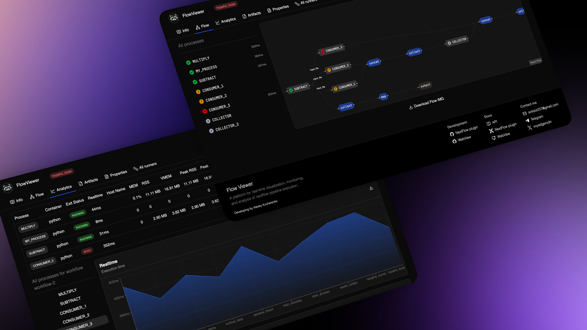

# About us

FlowViewer is a tool for real-time analysis of Nextflow pipeline execution. It helps gather statistics, view process graphs, and analyze output files.

The main advantage of FlowViewer is its `self-hosted` approach. You can deploy the tool on your own laboratory server, confident that your research data will not leak to third-party servers. Since the project is open-source, you can personally verify its security or customize the solution to create your own (non-commercial) build.

## Project development

The project is currently evolving rapidly, and you can help with its development. I am open to suggestions and collaboration. Feel free to contact me via email or social media; I would be happy to discuss ideas for the project's future growth, potential new features, and bug fixes.

You can also create pull requests on GitHub; this will greatly assist in adding new features and fixing bugs. I don't use "vibecoding," but if you do, I don't mind—the main thing is to maintain the code structure.

You can also support the project by becoming a GitHub sponsor or making a voluntary donation.

## Contact Information

* **Author**: Alexey Kucherenko
* **Email**: antidot237@gmail.com
* **Telegram**: [rosetomorrow](https://t.me/rosetomorrow)
* **X (Twitter)**: [voyadgerodin](https://x.com/voyadgerodin)
