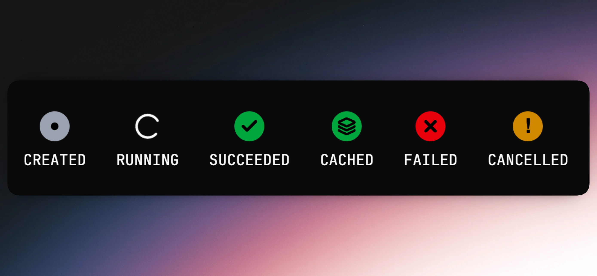
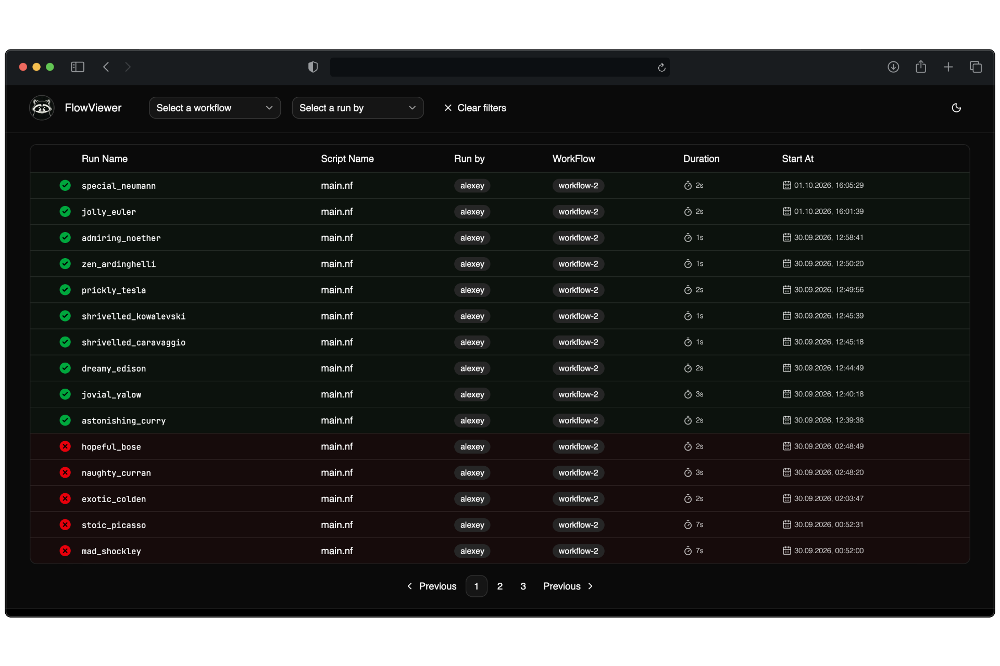
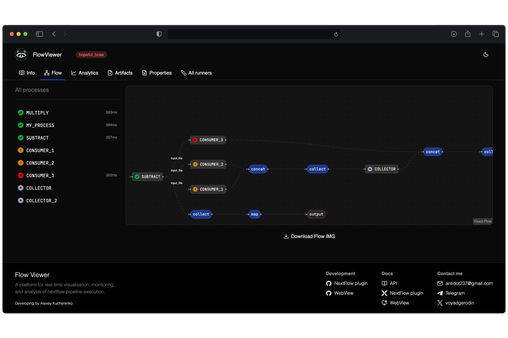
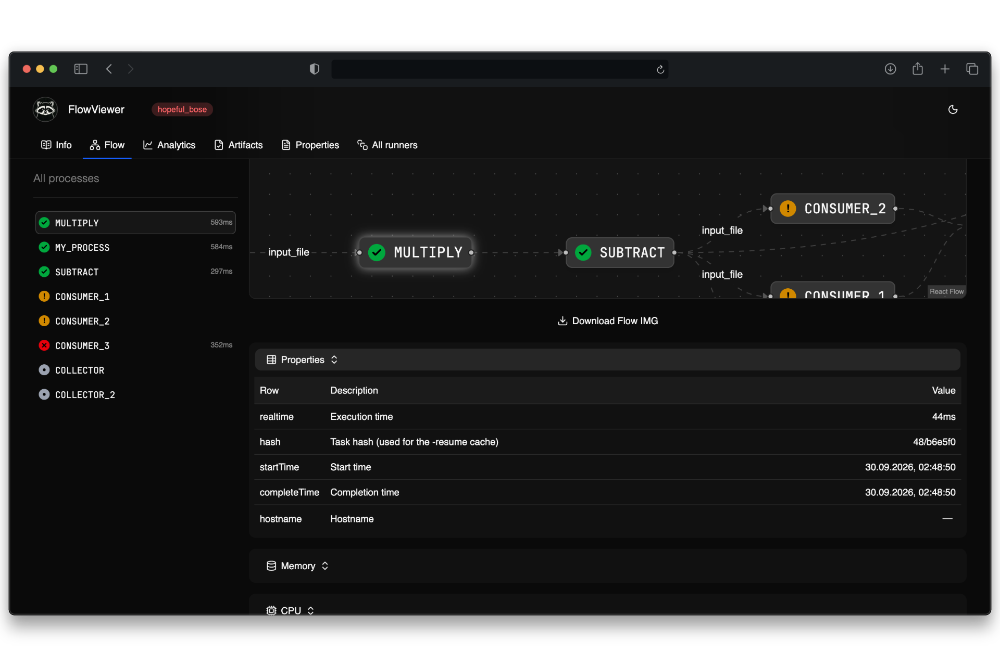
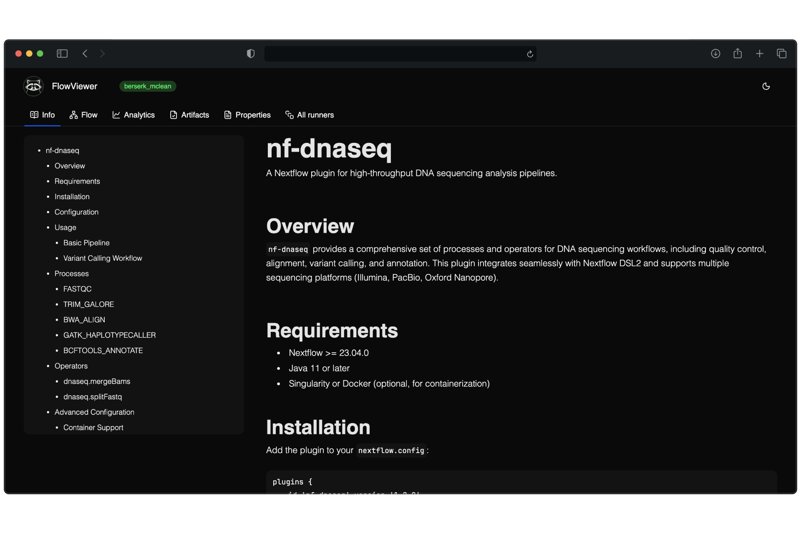
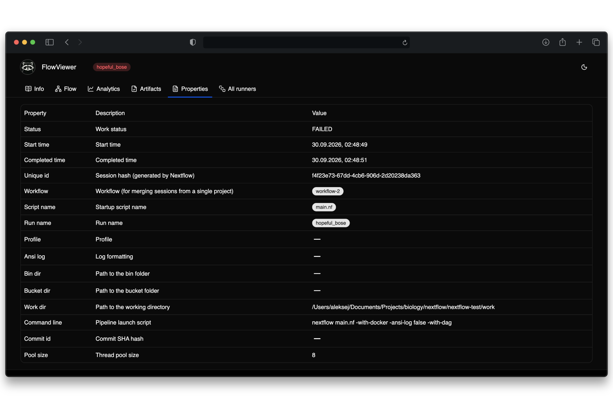
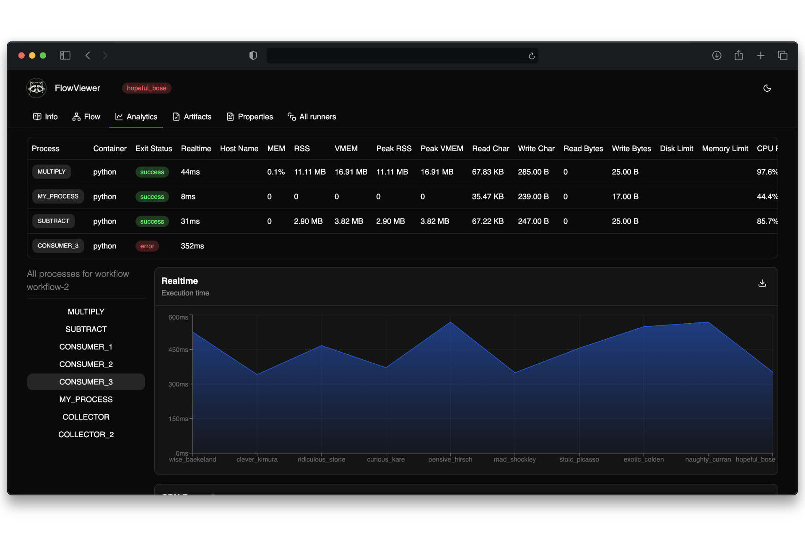
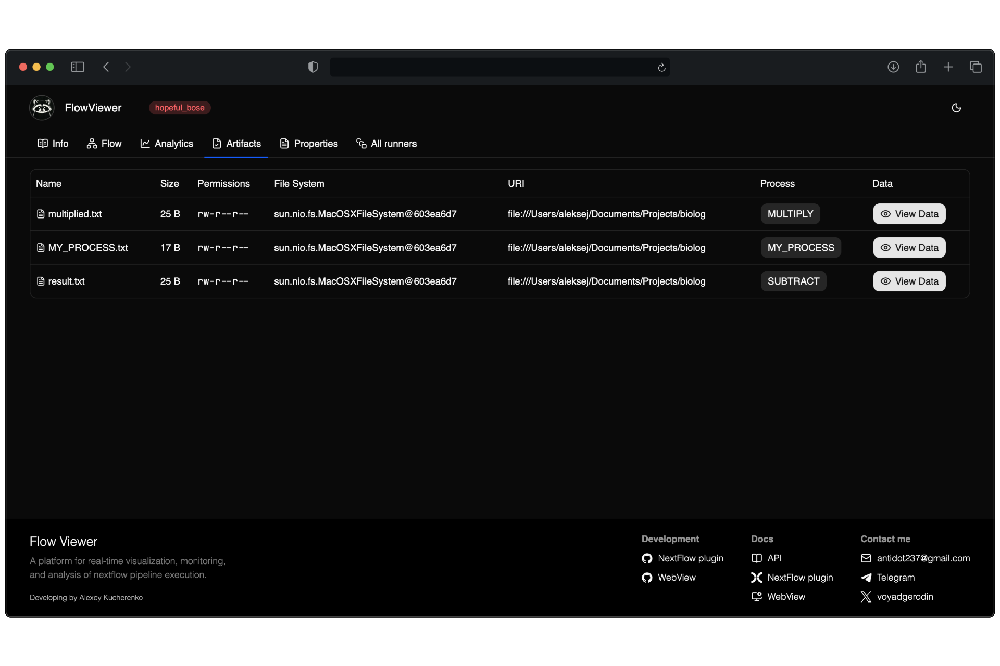
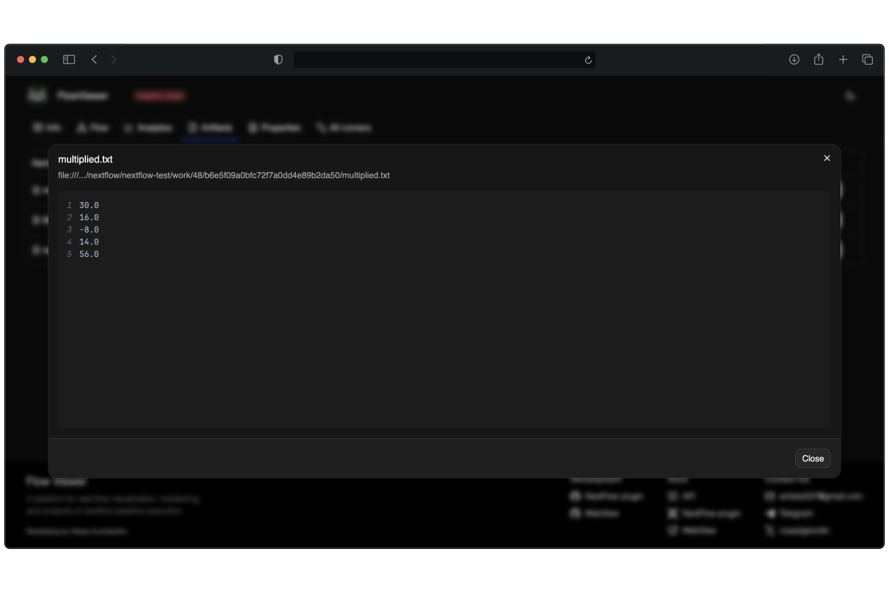
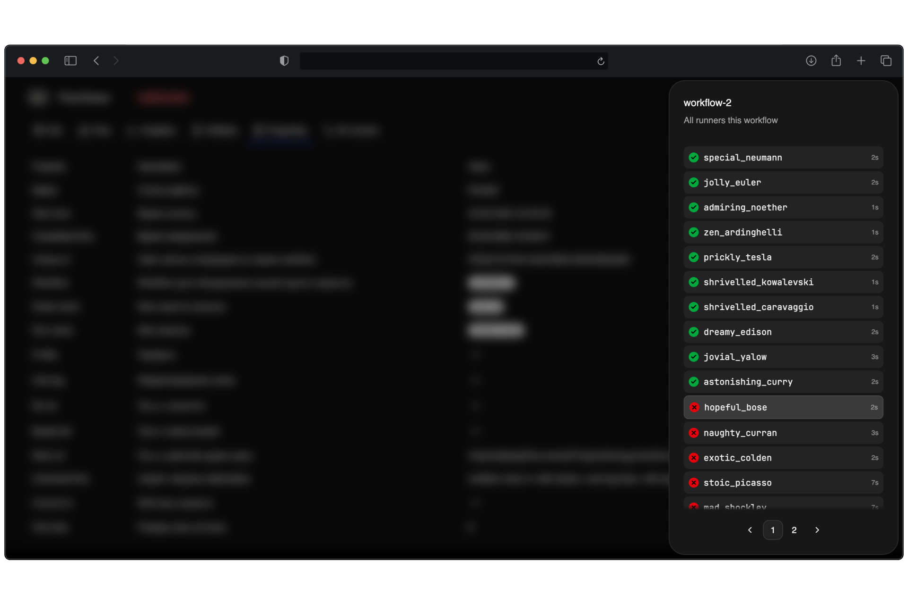

# WebView Documentation

## Running in Docker

```shell
docker run -d \
  -p 3000:3000 \
  -v $(pwd)/data:/data \
  flow-viewer
```

Open [http://localhost:3000](http://localhost:3000) in your browser. Done! 🎉

Since the application is packaged in a Docker container, it is easy to deploy on your own server (a self-hosted solution). However, it is important to launch the Docker image correctly!

When launching, you need to expose port `3000` — this is the port the application runs on.

To avoid data loss when restarting the image, you need to map the database directory from the container to the host system. The data folder inside the container is located at `/data`.

## Glossary

### WorkFlow

`WorkFlow` — This is a special grouping of sessions designed to consolidate various runs into a single project. Multiple developers can work on the same pipeline simultaneously, and it can also be executed on a server. The WorkFlow serves precisely to aggregate these runs for subsequent analytical calculations, making it possible to evaluate the effectiveness of pipeline improvements.

> **Recommendation**: specify the project name (sequencing, alignment) in the WorkFlow.

[Workflow Configuration Guide](/docs/nf-plugin#2-workflow)

---

### RunBy

`RunBy` — Identifies exactly who triggered the pipeline. Since multiple developers may work on the same pipeline—and it can also be triggered on a server—it is important to distinguish between these different executions.

[RunBy Setup Instructions](/docs/nf-plugin#3-run-by)

> **Recommendation**: specify the name of the person running the process (Alexey, Ksenia) or the server name (server-1, supercomputer) in RunBy.

---

### Work statuses

Both sessions and processes have operational statuses.



* `CREATED` — Created, ready for launch
* `RUNNING` — Running
* `SUCCEEDED` — Successfully completed
* `CACHED` — Successfully completed; data retrieved from cache
* `FAILED` — Crashed with an error (the error occurred in this process)
* `CANCELLED` — Forcefully terminated (an error occurred in another process, causing the entire pipeline to be forcefully terminated; the error did not originate in this process).

If a process has the status `CANCELLED`, it does not mean that the error originated in that process. Some other process failed, and this process was forcibly stopped.

## Site sections

### List of sessions

The session list displays all sessions, with new ones appearing in real-time. Operational status and duration are also updated in real-time. Filters at the top allow you to select sessions based on a specific workflow or the user who launched them.



### Proceedings of the session

A huge advantage is that the process graph is constructed at the very beginning rather than after the session completes (which can take many hours), making it much more convenient to monitor the processes' activity.



In addition to processes, other nodes are displayed on the graph:
* Input and output files (highlighted in brown)
* Operators (highlighted in light blue)

All data on the process activity graph is updated in real time.

If you click on any process in the graph or the process list on the left, it will be selected, allowing you to view its telemetry.


> **Important**: telemetry is available only for completed processes or those that crashed with an error. Telemetry will not be available for processes that are currently running or those that were forcibly terminated!

### Session description

You can create detailed session descriptions in Markdown format. This is useful when multiple developers are working on a pipeline and it is important to leave helpful instructions and notes for colleagues.



You can read more about creating documentation [here](/docs/nf-plugin#5-documentation)

> **Note**: This screenshot contains mock description data for a fictitious plugin.

### Session parameters

In the parameters section, you can view key details such as directory paths, the user who launched the process, the pipeline, the launch script used, and so on.



### Analytics

In the analytics section, you can examine the telemetry in detail. The section itself is divided into two parts:
* A table at the top
* Charts



#### Table

The table displays all telemetry for each process in the current session. The data shown relates only to the current session. Additionally, clicking on a process allows you to navigate to its graph page.

#### Charts

The charts display aggregated information for all sessions belonging to the same workflow as the current session.

You need to select a specific process from the list on the left, and the graphs will display the process's operational telemetry across all sessions in the workflow.

> **Important**:
> The process list displays not only the processes belonging to the current session but all processes from sessions associated with the given workflow.
> Do not be surprised if you see a process that is not part of the current session.

The graphs can also be downloaded in PNG format for use in scientific articles or reports.

> Note:
> Since a single workflow can have a large number of sessions, the data in the charts covers only the last 50 sessions!
> The ability to configure this setting will be added in the future.

### Artifacts

Artifacts are files created during the course of a session. 



Not all files created by the pipeline will be included in the list of artifacts — only those with the `publishDir` parameter specified. 

```groovy
process MY_PROCESS {
    publishDir 'results' // <- Important parameter

    output:
    path "MY_PROCESS.txt"

    script:
    """
    echo "Task ID is: ${task.id}" > MY_PROCESS.txt
    """
}
```

For artifacts, the process that initiated the file's creation is indicated. Clicking the process button allows you to navigate to that process on the graph.

There is also a file preview feature. Since files can be extremely large (tens of gigabytes), saving them in their entirety is impractical. The plugin settings allow you to specify a limit for how much of the file's initial data should be saved. You can read more about artifact configuration [here](/docs/nf-plugin#4-artifacts).



File previewing is intended not for detailed analysis, but rather for viewing the file's structure.

### All runners

To quickly switch between sessions of the same workflow, you can open the `All runners` menu. It lists all sessions belonging to the same workflow as the currently open session.


